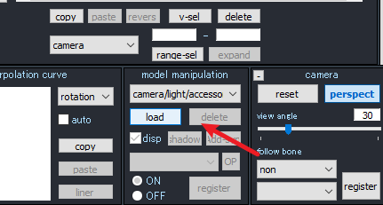
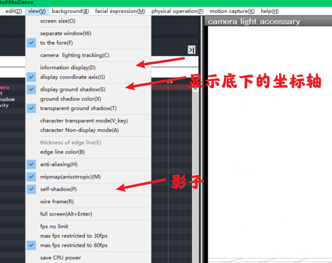

# 使用mmd

导入插件: [blender_mmd_tools](https://github.com/UuuNyaa/blender_mmd_tools/releases)
​

导入mmd
[https://github.com/GiveMeAllYourCats/cats-blender-plugin](https://github.com/GiveMeAllYourCats/cats-blender-plugin)

## mmd使用

先导入场景,

隐藏底部坐标轴

然后导入人物,动作,相机动作,最后导入音乐wav
