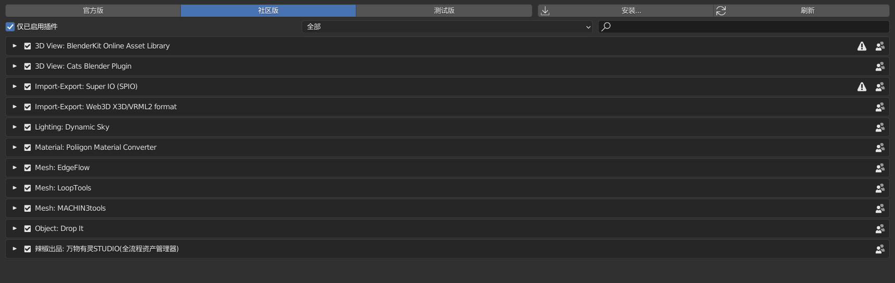
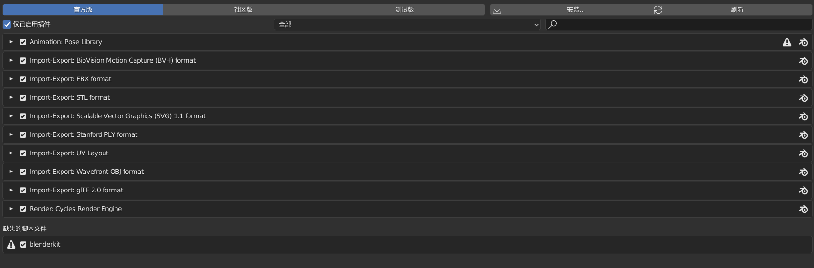

# 插件推荐

:::tip
 [https://github.com/agmmnn/awesome-blender](https://github.com/agmmnn/awesome-blender)

> blender插件目录

[https://docs.blender.org/manual/zh-hans/dev/advanced/blender_directory_layout.html](https://docs.blender.org/manual/zh-hans/dev/advanced/blender_directory_layout.html)
For _default installation location_ addons is usually found in;
> C:\Program Files\Blender Foundation\blender[version]\addons
> #steam
> D:\SteamLibrary\steamapps\common\Blender\3.0\scripts\addons

For the _secondary "User" location_, addons is usually found in;
> C:\Users[profile]\AppData\Roaming\Blender Foundation...

> **Design note**: the secondary location is typically used as a 'cache', the contents of which are copied back and forth between the temporary storage location and Blenders installation folder. This depends on the version of Blender used rather than the Operating System.
:::

## bagapie

[https://www.f12studio.fr/bagapie](https://www.f12studio.fr/bagapie)
[https://github.com/agmmnn/awesome-blender](https://github.com/agmmnn/awesome-blender)

## Poliigon Material Converter Addon for Blender

[https://help.poliigon.com/en/articles/2540839-poliigon-material-converter-addon-for-blender](https://help.poliigon.com/en/articles/2540839-poliigon-material-converter-addon-for-blender)
万物有灵
[https://shimo.im/docs/qjXWwYkGKccgXVgd/read](https://shimo.im/docs/qjXWwYkGKccgXVgd/read)

## Node Wrangler（免费，Blender自带）

## MACHIN3tools

MACHIN3tools 工具包是Blender软件的一个必装插件。作为一个免费的，不断发展的工具包，其在单个可自定义工具包中囊括了多种blender工具和pie菜单
[官网](https://machin3.io/MACHIN3tools/docs/)  
 [MACHIN3tools](https://github.com/machin3io/MACHIN3tools)

## [Screencast-Keys](https://github.com/nutti/Screencast-Keys)

显示您的按键
[https://github.com/nutti/Screencast-Keys](https://github.com/nutti/Screencast-Keys)

## drop it

[https://github.com/maxivz/interactivetoolsblender](https://github.com/maxivz/interactivetoolsblender)

## super io

[https://github.com/atticus-lv/super_io](https://github.com/atticus-lv/super_io)

## edge flow

[https://github.com/BenjaminSauder/EdgeFlow](https://github.com/BenjaminSauder/EdgeFlow)

## blenderkit

[https://www.blenderkit.com/](https://www.blenderkit.com/)

## 我的插件

